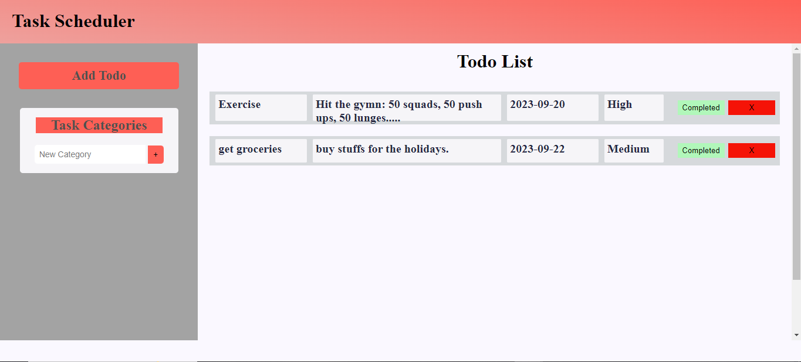

# Todo-App
===================================
This is a Todo app that allows users to quickly and easily add and delete events and tasks. With this App, users can effortlessly manage their tasks and events, helping them stay organized and on top of their tasks.
It is a project on @theodinproject intermediate frontend developer course.

## Built with
--------------

JavaScript
HTML
CSS
Webpack
Local Storage
Visual Studio Code
Git & Github

App Features
-------------
- Navigation bar

- Layout resources for different screensizes and orientaion.

Screenshots

#### Inactive

#### Active 1

#### Avtive 2

